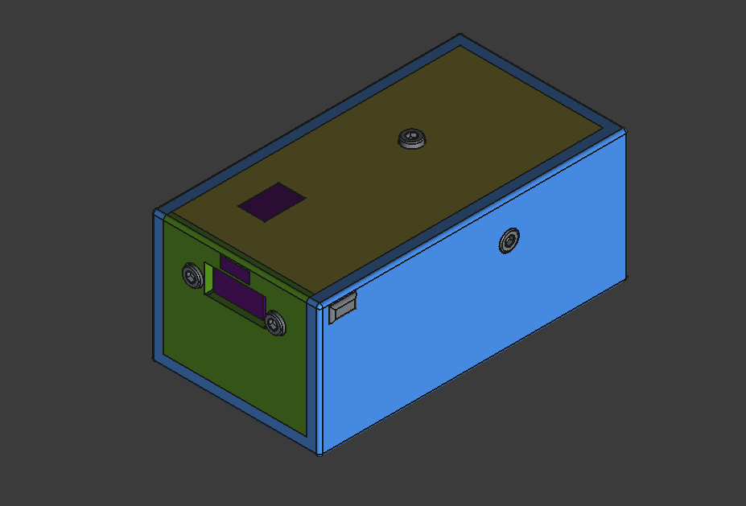

# 18650 Powerbank

This project is a custom case designed to house a USB-C powerbank board and an 18650 battery holder.

## Components

1. **USB-C Powerbank Board**
   - [AliExpress Link](https://www.aliexpress.com/item/1005007232950866.html)

2. **18650 Battery Holder**
   - [LCSC Link](https://www.lcsc.com/product-detail/Button-And-Strip-Battery-Connector_MYOUNG-BH-18650-B1BA007_C6937126.html)

## Description

The case is designed to securely hold the USB-C powerbank board and the 18650 battery holder, providing a compact and portable power solution. The design ensures that all components fit snugly and are protected from external damage.

## Usage

Once assembled, the powerbank can be used to charge devices via the USB-C port and USB-A. Ensure that the 18650 batteries are properly charged before use.
